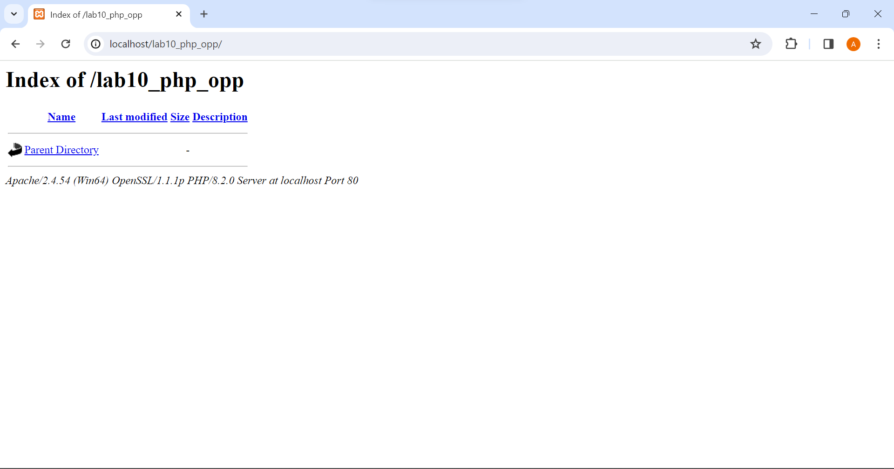

# Lab10Web

# PEMOGRAMAAN WEB

Afrizal Fajrianto Anggara Sakti (312210449)

Teknik Informatika - UNIVERSITAS PELITA BANGSA
______________________________________________

## MENJALANKAN PROGRAM XAMPP


Pertama, nyalakanlah tombol Apache dan juga MySQL pada xampp agar semua data dan perubahan-perubahan yang terjadi dapat terhubung ke localhost.

## PEMBUATAN FOLDER

Selanjutnya, buatlah folder pada htdocs dengan nama Lab10_php_oop yang dilanjut dengan pengecekan dokumen pada localhost dengan URL : http://localhost:8080/Lab10Web/Lab10_php_oop/

Dan jika dokumen dapat terbaca seperti dibawah ini maka artinya sudah berhasil terhubung.



## MEMBUAT FILE MOBIL.PHP 


Setelah kalian membuat folder, selanjutnya buatlah beberapa file diantaranya yaitu file mobil.php dengan ditambahkannya kode berikut untuk mendapatkan hasil seperti gambar diatas.

```php
<?php
/**
* Program sederhana pendefinisian class dan pemanggilan class.
**/

class Mobil
{
    private $warna;
    private $merk;
    private $harga;

    public function __construct()
    {
        $this->warna = "Biru";
        $this->merk = "BMW";
        $this->harga = "10000000";
    }

    public function gantiWarna ($warnaBaru)
    {
        $this->warna = $warnaBaru;
    }
    public function tampilWarna ()
    {
        echo "Warna mobilnya : " . $this->warna;
    }
}
// membuat objek mobil
$a = new Mobil();
$b = new Mobil();

// memanggil objek
echo "<b>MOBIL PERTAMA</b><br>";
$a->tampilWarna();
echo "<br>Mobil pertama ganti warna<br>";
$a->gantiWarna("Merah");
$a->tampilWarna();

// memanggil objek
echo "<br><b>MOBIL KEDUA</b><br>";
$b->gantiWarna("Hijau");
$b->tampilWarna();
?>
```

## MEMBUAT FILE FORM.PHP

Dilanjut dengan membuat file baru dengan nama form.php yang didalamnya berisi kode berikut:

```php
<?php
/**
* Nama Class: Form
* Deskripsi: CLass untuk membuat form inputan text sederhana
**/

class Form
{
    private $fields = array();
    private $action;
    private $submit = "Submit Form";
    private $jumField = 0;

    public function __construct($action, $submit)
    {
        $this->action = $action;
        $this->submit = $submit;
    }
    
    public function displayForm()
    {
        echo "<form action='".$this->action."' method='POST'>";
        echo '<table width="100%" border="0">';
        for ($j=0; $j<count($this->fields); $j++) {
            echo "<tr><td align='right'>".$this->fields[$j]['label']."</td>";
            echo "<td><input type='text' name='".$this->fields[$j]['name']."'></td></tr>";
        }
        echo "<tr><td colspan='2'>";
        echo "<input type='submit' value='".$this->submit."'></td></tr>";
        echo "</table>";
    }

    public function addField($name, $label)
    {
        $this->fields [$this->jumField]['name'] = $name;
        $this->fields [$this->jumField]['label'] = $label;
        $this->jumField ++;
    }
}

?>
```

## MEMBUAT FILE FORM_INPUT.PHP

Terakhir, kalian perlu membuat file baru dengan nama form_input.php 


Dan untuk mendapatkan hasil seperti gambar diatas, kalian perlu memasukan kode berikut:

```php
<?php
/**
* Program memanfaatkan Program 10.2 untuk membuat form inputan sederhana.
**/

include "form.php";

echo "<html><head><title>Mahasiswa</title></head><body>";
$form = new Form("","Input Form");
$form->addField("txtnim", " <b> Nim : </b> ");
$form->addField("txtnama", " <b> Nama : </b> ");
$form->addField("txtalamat", "<b> Alamat :</b>");
echo "<h3>Silahkan isi form berikut ini :</h3>";
$form->displayForm();
echo "</body></html>";

?>
```


SELESAI.